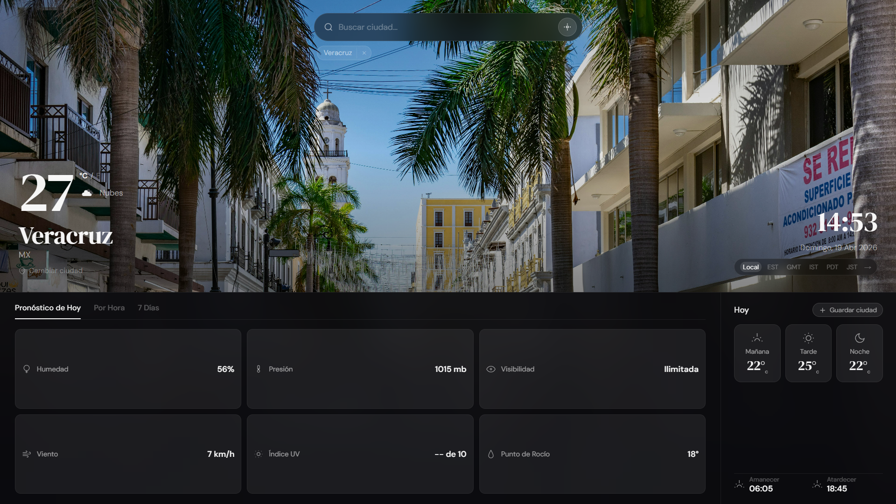
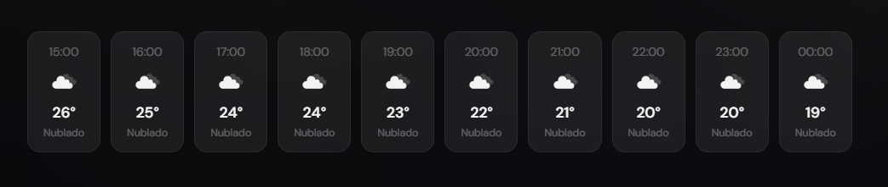
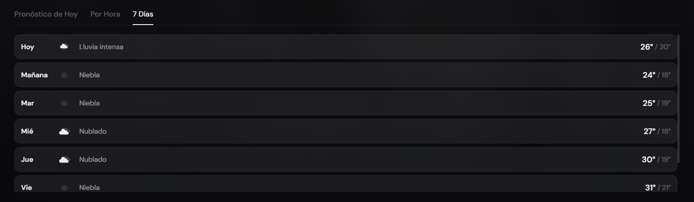

<div align="center">

# Smart Weather Dashboard

Aplicación web moderna, responsive y de pantalla completa con pronóstico del tiempo en tiempo real, fotos de la ciudad desde Pexels y panel científico de datos meteorológicos.

[]()
[]()
[]()
[]()
[]()
[]()

### Demo en línea

**https://smart-weather-dashboard-plum.vercel.app/**

</div>

---

## Descripción

Smart Weather Dashboard es una aplicación de clima desarrollada con HTML, CSS y JavaScript puro. Muestra el tiempo en tiempo real para cualquier ciudad del mundo, con foto de fondo dinámica obtenida desde Pexels, pronóstico por horas, pronóstico de 7 días, datos meteorológicos detallados y reloj mundial con múltiples zonas horarias.

---

## Características principales

| Funcionalidad | Descripción |
| --- | --- |
| Búsqueda de ciudades | Autocompletado con Nominatim (barrios, colonias, municipios) |
| Foto de fondo dinámica | Imágenes HD reales de cada ciudad desde Pexels API |
| Pronóstico actual | Temperatura, condición, ícono y datos en tiempo real |
| Pronóstico por horas | Datos hora a hora para el resto del día |
| Pronóstico 7 días | Máximas y mínimas diarias de la semana |
| Estadísticas del día | Humedad, presión, visibilidad, viento, UV y punto de rocío |
| Períodos del día | Temperatura promedio de mañana, tarde y noche |
| Amanecer y atardecer | Horarios exactos según la ciudad |
| Reloj mundial | Hora local y 5 zonas horarias seleccionables |
| Historial | Chips de ciudades buscadas recientemente |
| Teclado físico | Navegación completa por teclado (↑ ↓ Enter Escape) |
| Responsive | Adaptado a móvil, tablet y escritorio |

---

## APIs utilizadas

### OpenWeatherMap API
API utilizada para obtener datos meteorológicos actuales de cualquier ciudad del mundo.
```url
https://api.openweathermap.org/data/2.5/weather
```

### Open-Meteo API
API pública y gratuita utilizada para obtener pronóstico horario y de 7 días.
```url
https://api.open-meteo.com/v1/forecast
```

### Pexels API
API utilizada para obtener fotos HD reales de ciudades como fondo dinámico.
```url
https://api.pexels.com/v1/search
```

### Nominatim API (OpenStreetMap)
API pública y gratuita utilizada para autocompletar ciudades, barrios y colonias.
```url
https://nominatim.openstreetmap.org/search
```

---

## Fondo dinámico inteligente

La búsqueda de imagen sigue una cadena con fallbacks automáticos:

| Nivel | Descripción |
| --- | --- |
| 1 | Nombre del barrio o colonia exacto |
| 2 | Nombre del barrio + "Mexico" |
| 3 | Ciudad padre (si es diferente al barrio) |
| 4 | Estado o región |
| 5 | Foto temática del clima (lluvia, noche, tormenta…) |
| 6 | Gradiente de color según condición climática |

---

## Tecnologías utilizadas

<div align="center">

[]()
[]()
[]()
[]()
[]()

</div>

---

## Estructura del proyecto

```text
smart-weather-dashboard/
│── index.html
│── style.css
│── script.js
│── README.md
│── dashboard-light.png
│── dashboard-dark.png
│── scientific-panel.png
│── mobile-view.png
```

---

## Vista previa

### Dashboard principal 
  

---

### Panel científico

| Pronóstico por horas | Pronóstico 7 días |
| --- | --- |
|  |  |

---

## Competencias demostradas

* Consumo de múltiples APIs REST con fetch y manejo de errores.
* Autocompletado con deduplicación y navegación por teclado.
* Gestión de caché con localStorage y TTL configurable.
* Carga diferida de imágenes con preload y timeout propio.
* Animaciones y transiciones CSS/JS sin librerías externas.
* Diseño glassmorphism full-screen con paneles fijos.
* Responsive Design adaptado a móvil, tablet y escritorio.
* Manejo avanzado del DOM y eventos del navegador.
* Organización profesional del código con separación de responsabilidades.
* Escalabilidad y mejora continua del proyecto.

---

## Enfoque profesional

Proyecto orientado a demostrar habilidades técnicas en desarrollo web mediante una solución funcional y visualmente cuidada, con énfasis en experiencia de usuario, mantenibilidad, manejo de APIs y diseño moderno tipo dashboard.
